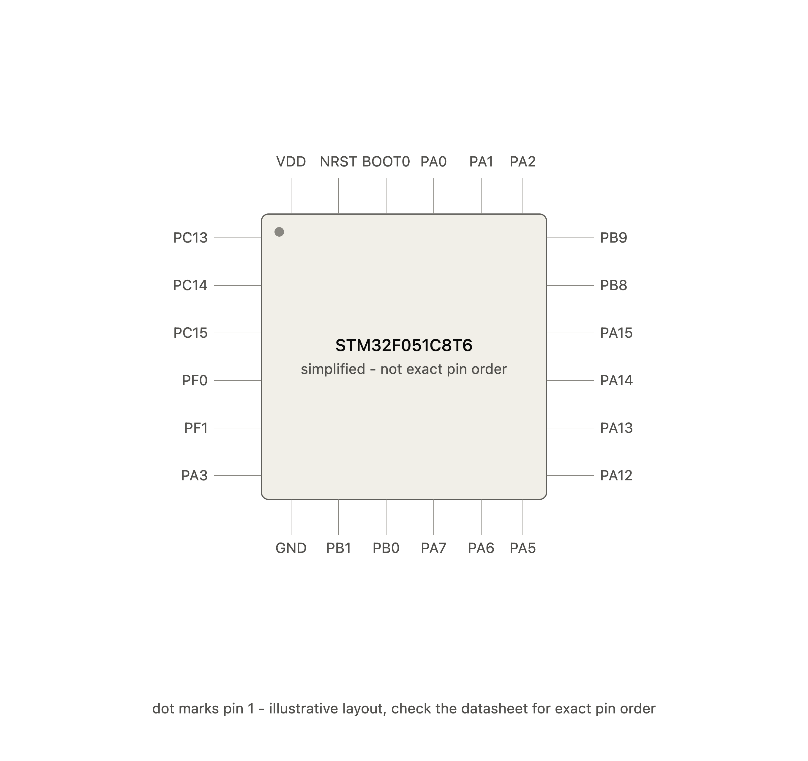

# Episode 8: Enums / Named Constants

**Video:** 

> This episode needs the board connected and flashed - the proof is
> a flash pattern plus a speed change you can see. See the
> [Hardware setup section](../README.md#hardware-setup-read-this-first-if-youre-new-here)
> in the root README if you haven't wired up yet.

## The idea
`GPIO_PIN_4` isn't magic, and it isn't special syntax - it's just a
name for a plain number, defined once inside a HAL header file. Every
`GPIO_PIN_4` used since episode 2 has secretly just been a number
wearing a label the whole time.

```c
typedef enum
{
  SPEED_SLOW = 500,
  SPEED_FAST = 100,
} BlinkSpeed;
```

`SPEED_SLOW` isn't a special "speed" thing - it **is** the number
500. `SPEED_FAST` **is** 100. An enum is just a list of named
constants; the name exists purely to make the code readable to a
human, and gets replaced with the plain number underneath.

Named constants aren't unique to enums either - HAL pin names like
`GPIO_PIN_4` work the same way, defined as constants tied to a
specific bit position (each pin corresponds to one bit in a hardware
register - `GPIO_PIN_4` selects bit 4). Different mechanism under the
hood than our `BlinkSpeed` enum, same underlying idea: a name
standing in for a number.



This is a simplified illustration, not the real pinout - it shows 6
example pins per side to stay legible. In reality, the STM32F051C8T6
is a 48-pin LQFP48 package: **12 real pins per side, 48 total**. See
the actual datasheet for the exact, full pin order.

## Try it yourself
1. Build and flash `main.c` as-is.
2. Watch the LED: two quick flashes first - proof that
   `GPIO_PIN_4 == 0x0010` is literally true, the exact constant
   you've been using since episode 2 to wire up this very LED. Then
   a slow, steady blink - because `HAL_Delay(current_speed)` is
   really just `HAL_Delay(500)` underneath the `SPEED_SLOW` name.
3. Change `BlinkSpeed current_speed = SPEED_SLOW;` to
   `SPEED_FAST` and reflash - the blink speeds up, because the name
   changed which plain number gets used, nothing more.

## Why the `if` always evaluates true (on purpose)
This isn't really "decision-making" the way `if/else` was in episode
5, where the outcome genuinely depended on something changing
(`blinks_done`). Here, both sides of `==` are fixed, unchanging
values - `GPIO_PIN_4` is a constant defined once in a HAL header, and
`0x0010` is just... `0x0010`. Nothing in the program can ever make
this comparison false. It's not real branching logic; it's a staged
proof - a way to make an invisible fact ("these two things are
equal") visible on the LED, purely for demonstration. Same trick as
episode 4's `try_something()`, just used to display a fact instead of
test a runtime condition.

## `0x0010` is 16 - and not by coincidence
`0x0010` in hex is 16 in decimal. That's not an arbitrary choice.

Each GPIO port on the STM32 (like `GPIOA`) has 16 individual pins,
numbered 0 through 15. Under the hood, HAL controls these pins using
hardware registers - a register here is just a 16-bit number where
each bit position corresponds to one specific pin. Bit 0 = pin 0, bit
1 = pin 1, bit 4 = pin 4, and so on.

To represent "pin 4" as a number usable in these bit-level
operations, HAL needs a value with only bit 4 turned on, everything
else off:

```
bit:    15 14 13 12 11 10  9  8  7  6  5  4  3  2  1  0
value:   0  0  0  0  0  0  0  0  0  0  0  1  0  0  0  0
```

Reading that binary pattern as a number gives exactly 16 - `0x0010`
in hex. `GPIO_PIN_4` isn't 16 by coincidence or convention - it's 16
because that's the unique number whose binary form has only the 4th
bit lit up, which is precisely what's needed to select pin 4 and
nothing else when the hardware does its bit-level checking.

This is also why the pattern doubles each time: `GPIO_PIN_0 = 1`,
`GPIO_PIN_1 = 2`, `GPIO_PIN_2 = 4`, `GPIO_PIN_3 = 8`,
`GPIO_PIN_4 = 16`... each one is just shifting which single bit is
turned on, one position further left.

## Wiring
Same single-LED setup as earlier episodes:
PA4 → 220Ω resistor → LED anode, LED cathode → GND.
